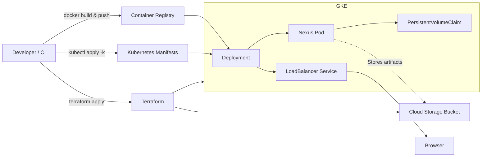
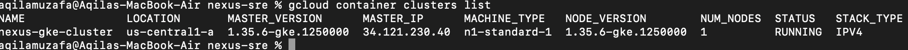
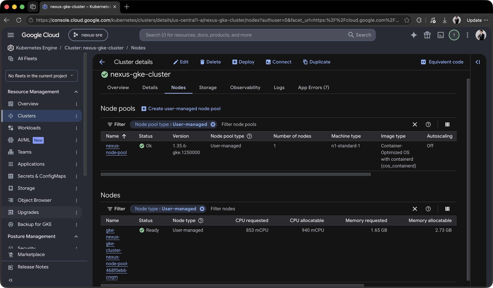
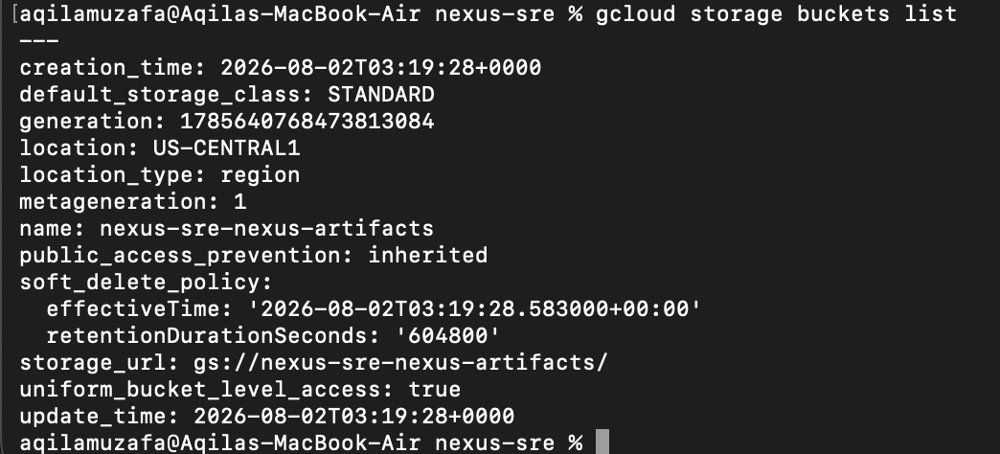
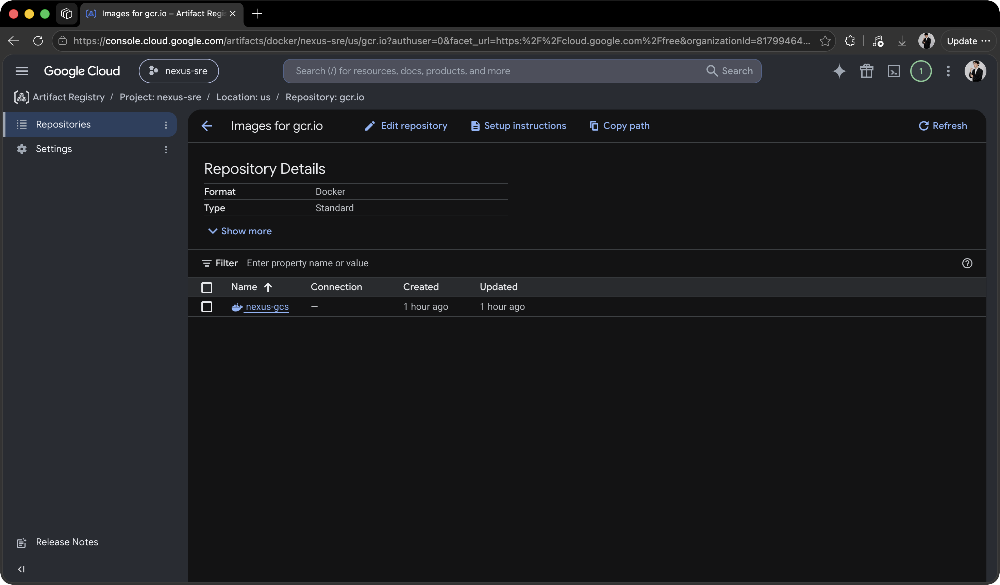
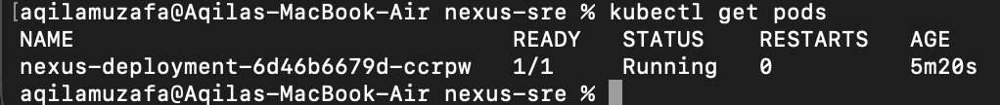
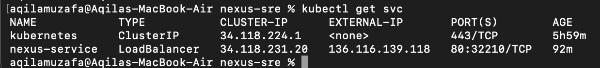
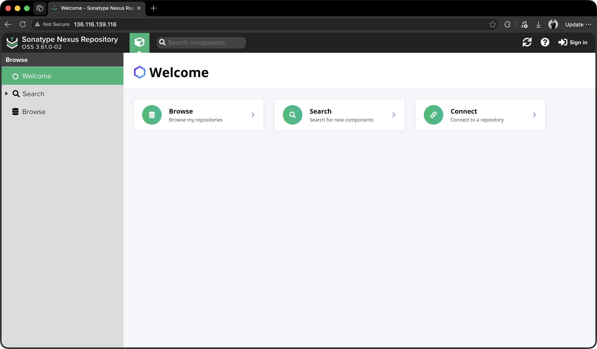

# Nexus Repository Manager on GKE — SRE Technical Assignment

## Project Overview

This project deploys **Sonatype Nexus Repository Manager 3** on **Google Kubernetes Engine (GKE)** using **Terraform**, **Docker**, and **Kubernetes (Kustomize)**. A custom Docker image extends the official Nexus image by installing the Google Cloud Storage Blob Store plugin, allowing Nexus artifacts to be stored in **Google Cloud Storage (GCS)**.

## Architecture Diagram



## Technologies Used

| Layer | Technology |
|---|---|
| **Base Image** | `sonatype/nexus3:3.61.0` |
| **Orchestration** | Google Kubernetes Engine (GKE) |
| **IaC** | Terraform |
| **K8s Templating**| Kustomize |
| **Blob Storage** | Google Cloud Storage |
| **Image Registry** | Google Container Registry (GCR) |

## Repository Structure

```text
nexus-sre/
├── Dockerfile                  # Custom Nexus image with GCS plugin
├── k8s/                        # Kustomize, Deployment, PVC, and Service manifests
├── terraform/                  # Terraform configuration for GKE and GCS
└── screenshots/                # Evidence of successful deployment
```

## Prerequisites

Install the following tools:

- Docker
- Google Cloud SDK (`gcloud`)
- Terraform
- kubectl
- Kustomize

Authenticate with Google Cloud:

```bash
gcloud auth login
gcloud auth application-default login
gcloud config set project <YOUR_PROJECT_ID>
gcloud auth configure-docker
```

## Deployment

### 1. Provision Infrastructure

```bash
cd terraform

terraform init
terraform apply

# Return to repository root
cd ..
```

### 2. Configure kubectl

```bash
gcloud container clusters get-credentials nexus-gke-cluster \
    --zone us-central1-a \
    --project <YOUR_PROJECT_ID>
```

### 3. Build and Push Image

```bash
docker build --platform linux/amd64 \
    -t gcr.io/<YOUR_PROJECT_ID>/nexus-gcs:latest .

docker push gcr.io/<YOUR_PROJECT_ID>/nexus-gcs:latest
```

### 4. Deploy Kubernetes Resources

```bash
kubectl apply -k k8s
```

### 5. Verify

```bash
kubectl get pods
kubectl get svc
```

The Nexus Pod should reach the **Running** state, and the Service should expose an **EXTERNAL-IP** that can be used to access the Nexus web interface.

## Troubleshooting

Common issues encountered during deployment:

- GKE authentication (`gke-gcloud-auth-plugin`)
- Container Registry authentication
- ImagePullBackOff caused by image registry authentication/IAM configuration
- Nexus filesystem permissions on PersistentVolume
- Resource requests exceeding node capacity


## Continuous Integration Proposal (Task Number 5)

A GitHub Actions workflow would be triggered whenever changes are pushed to the `main` branch. The workflow would:

1. Build the updated Nexus Docker image.
2. Push the image to Google Container Registry (GCR) or Artifact Registry.
3. Validate the Terraform configuration (`terraform fmt` and `terraform validate`).
4. Validate the Kubernetes manifests (or build them with Kustomize).
5. Deploy the updated image and manifests to a dedicated test GKE cluster using `kubectl apply -k` (or Helm).
6. Verify that the deployment succeeds before promoting the changes to production.

## Screenshots

<details>
<summary><b>1. Terraform Provisioning Output</b> — GKE cluster, node pool, and GCS bucket creation</summary>


</details>

<details>
<summary><b>2. GKE Cluster List View</b> — <code>nexus-gke-cluster</code> running in GCP Console</summary>


</details>

<details>
<summary><b>3. GKE Node Pool Details</b> — Preemptible <code>n1-standard-1</code> node configuration</summary>


</details>

<details>
<summary><b>4. GCS Bucket List View</b> — Provisioned <code>nexus-sre-nexus-artifacts</code> bucket</summary>


</details>

<details>
<summary><b>5. Artifact Registry / GCR Repository</b> — Custom <code>nexus-gcs</code> docker image pushed</summary>


</details>

<details>
<summary><b>6. Kubernetes Pod Status</b> — <code>nexus-deployment</code> pod running via <code>kubectl get pods</code></summary>


</details>

<details>
<summary><b>7. Kubernetes Service Endpoint</b> — LoadBalancer external IP via <code>kubectl get svc</code></summary>


</details>

<details>
<summary><b>8. Nexus UI Dashboard</b> — Nexus Repository Manager web interface landing page</summary>


</details>

## Cleanup

```bash
terraform destroy
```
